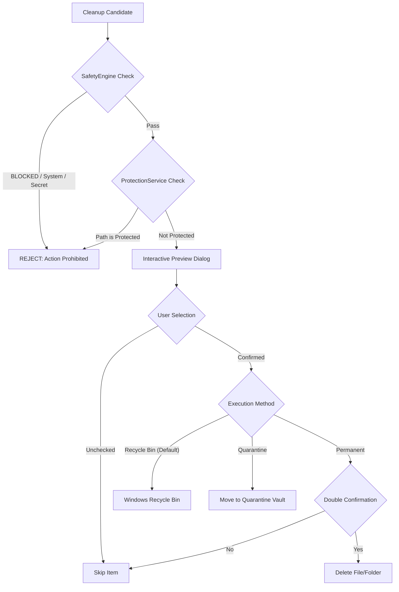

# PcClean Safety Engine & Protection System

The core design differentiator of PcClean is its **Safety Engine**. PcClean is engineered specifically for developers who cannot afford to lose hours of work, configuration, secrets, or active databases to reckless cleaning tools.

---

## 1. Safety Levels

Every scanned directory or file is evaluated by [`SafetyEngine`](file:///E:/window-software/win-cleaner/services/safety_engine.py) and tagged with one of six explicit safety tiers:

| Safety Level | Color Indicator | Can Delete? | Requires Confirmation? | Description & Examples |
| :--- | :--- | :--- | :--- | :--- |
| **`SAFE`** | 🟢 Green | Yes | Normal | Safe junk that has no ongoing utility. Examples: `AppData\Local\Temp`, crash dumps, empty temporary directories, browser shader caches. |
| **`SAFE_REDOWNLOAD`** | 🔵 Blue | Yes | Normal | Build tool package caches that can be re-fetched automatically upon next build or install. Examples: `npm-cache`, `pip\cache`, `uv\cache`, Playwright browsers (`ms-playwright`), Gradle caches. |
| **`REVIEW`** | 🟡 Yellow | Conditional | Explicit Review | May contain useful data or active assets. User must review before selecting. Examples: Application leftovers from uninstalled programs, large downloaded zip archives. |
| **`IMPORTANT`** | 🟣 Purple | No (Default) | Double Confirmation | High-value developer tools or configs. Examples: Installed VS Code extensions, Android SDK build tools, active Python virtual environments. |
| **`DANGEROUS`** | 🟠 Orange | No (Strict) | Explicit Warning | Highly sensitive locations that could break developer workflows or system components. Examples: Docker volume stores, system service data. |
| **`BLOCKED`** | 🔴 Red | **NEVER** | Not Possible | Protected system critical directories, credentials, SSH keys, databases, source control roots. PcClean will strictly refuse to touch these. |

---

## 2. Hardcoded Blacklists & Protected Targets

PcClean enforces strict, un-bypassable exclusions in code:

### System Critical Directories
PcClean will never delete or allow selection of:
- Drive roots (`C:\`, `D:\`)
- Windows system folders (`C:\Windows`, `C:\Windows\System32`, `C:\Windows\SysWOW64`, `C:\Windows\WinSxS`)
- Program Files folders (`C:\Program Files`, `C:\Program Files (x86)`)
- System Volume Information & `$Recycle.Bin`
- Recovery and Boot directories

### Sensitive Developer Extensions (`PROTECTED_EXTENSIONS`)
Any file matching the following extensions is automatically evaluated as **`BLOCKED`**:
```python
PROTECTED_EXTENSIONS = {
    ".env",
    ".env.local",
    ".env.development",
    ".env.production",
    ".env.test",
    ".ssh",
    ".pem",
    ".key",
    ".pfx",
    ".p12",
    ".cer",
    ".crt",
    ".pub",
    ".id_rsa",
    ".id_ed25519",
    ".id_ecdsa",
    ".db",
    ".sqlite",
    ".sqlite3",
    ".mdf",
    ".ldf",
    ".kdbx",
    ".gitconfig",
    ".bashrc",
    ".zshrc",
}
```

### Sensitive Filenames (`PROTECTED_FILENAMES`)
Files with the following names are blocked regardless of extension:
```python
PROTECTED_FILENAMES = {
    "id_rsa",
    "id_rsa.pub",
    "id_ed25519",
    "id_ed25519.pub",
    "known_hosts",
    "authorized_keys",
    ".env",
    ".env.local",
    "credentials",
    "config.json",
    "settings.json",
    "private.key",
}
```

---

## 3. Custom Protected Paths (`ProtectionService`)

Users can register custom directories that should never be scanned or cleaned:
- Protected paths are stored in an encrypted/local SQLite database: `%LOCALAPPDATA%\PcClean\pcclean.db`.
- Hierarchical checking: If `D:\Projects` is protected, every subdirectory (e.g., `D:\Projects\my-app\node_modules`) inherits the protection block unless specifically un-protected.
- Can be managed via UI (**Protected** view) or CLI (`pcclean protected add <path>`).

---

## 4. Deletion Pipeline & Safeguards



### Safe Quarantine Vault
When Quarantine mode is used:
1. Candidate directory or file is moved atomically into `%LOCALAPPDATA%\PcClean\Quarantine\<timestamp>_<basename>`.
2. Metadata is logged in SQLite:
   - Original path
   - Quarantine path
   - Total size in bytes
   - Reason / Category
   - Timestamp
3. In the **History / Quarantine** view, users can click **Restore** at any time to return the folder to its original location.
